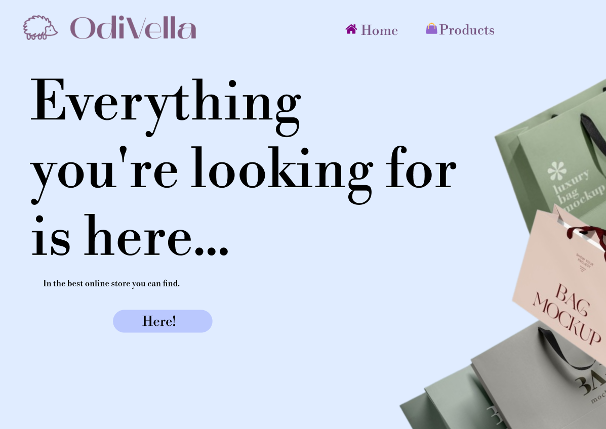
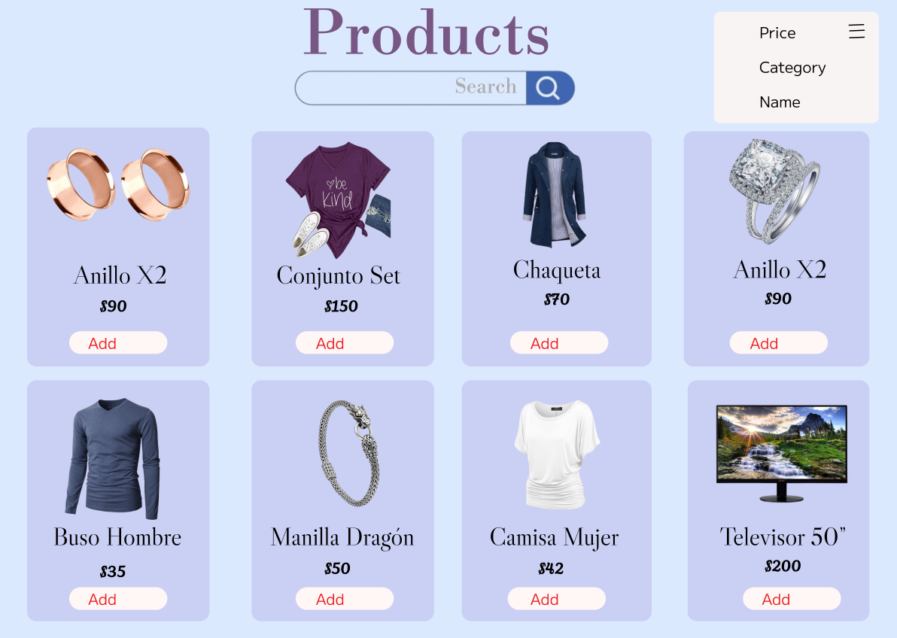
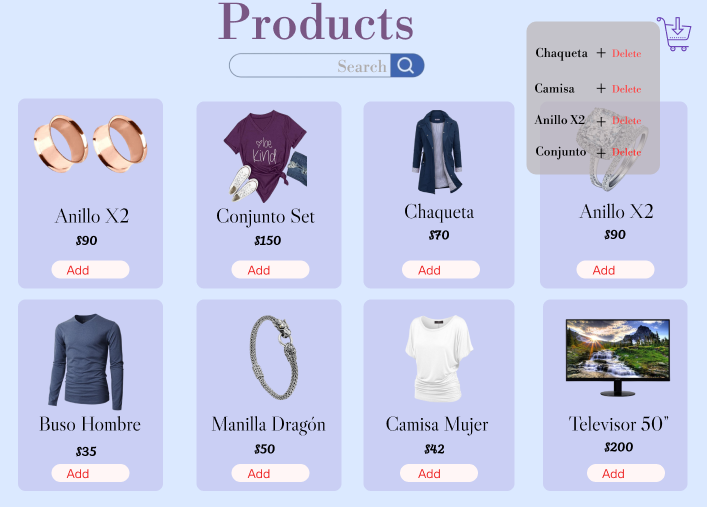
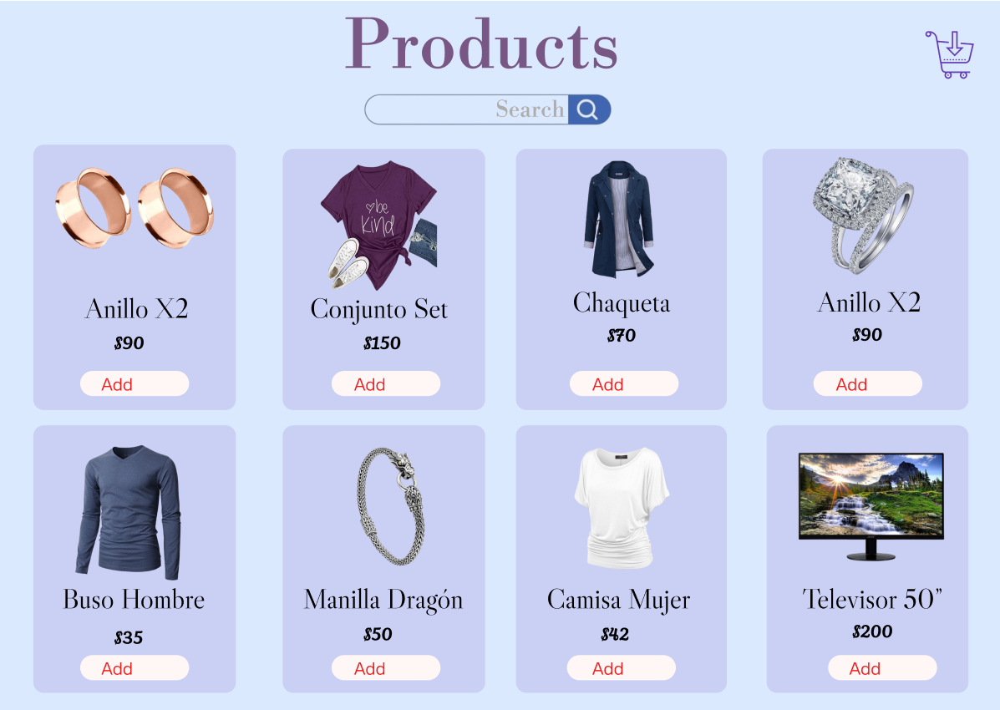

# 🛍️ Odivella Store

**Odivella Store** es una tienda virtual desarrollada con HTML, CSS y JavaScript que permite a los usuarios explorar productos desde una API, filtrarlos por categorías, añadirlos al carrito de compras y disfrutar de una experiencia responsive moderna. Ideal para prácticas de desarrollo web frontend con integración de datos reales.

---

## 📌 Descripción del proyecto

Este proyecto simula una tienda online funcional conectada a una API real, permitiendo al usuario:

- Visualizar todos los productos disponibles.
- Filtrar por categorías como ropa de hombre/mujer, joyería y tecnología.
- Agregar y quitar productos del carrito con persistencia usando localStorage.
- Disfrutar de un diseño responsivo para dispositivos móviles y de escritorio.

---

## 🖼️ Capturas de pantalla

### 🏠 Página principal


### 🧭 Filtros por categorías, nombre, precio


### 🛒 Carrito de compras


### 📱 Productos



---

## 🚀 Instalación y ejecución

1. **Clonar el repositorio**

```bash
git clone https://github.com/ValentinaDelgadoRincon/OdiVella-Store.git
```

2. **Abrir la carpeta del proyecto**

```bash
cd odivella-store
```

3. **Ejecutar el sitio**

- Abre `index.html` directamente con tu navegador  
**O usa un servidor local:**

---

## ⚙️ Tecnologías utilizadas

| Tecnología      | Uso principal                                      |
|----------------|----------------------------------------------------|
| **HTML5**      | Estructura y semántica del contenido               |
| **CSS3**       | Estilos, diseño responsive y animaciones           |
| **JavaScript** | Funcionalidad dinámica, carrito, filtros, API      |
| **FakeStore API** | Fuente de productos (`https://fakestoreapi.com`) |
| **Font Awesome** | Iconos modernos y visualmente atractivos         |
| **Google Fonts** | Tipografías personalizadas                       |
| **LocalStorage** | Guardado de datos del carrito entre sesiones     |

---

## 📁 Estructura del proyecto

```plaintext
odivella-store/
├── index.html                  # Página principal
├── category.html               # Página con productos filtrados por categoría          
├── css/
│   └── style.css               # Estilos generales
├── js/
│   ├── main.js                 # Lógica de carga y visualización de productos
│   ├── category.js             # Lógica de filtrado por categorías
│   └── cart.js                 # Lógica del carrito y localStorage
│   └── screenshots/            # Capturas de pantalla de la interfaz
│       ├── home.png
│       ├── categories.png
│       ├── cart.png
└── README.md                   # Documentación del proyecto
```

---

## 👨‍💻 Autores

| Nombre                             | Rol                        | Contacto                       |
|-----------------------------------|----------------------------|--------------------------------|
| **Valentina Delgado Rincon** | Desarrollador principal   | valentinadr1403@gmail.com      |

---

## 📈 Estado del proyecto

| Característica                              | Estado     |
|--------------------------------------------|------------|
| Visualización de productos desde API       | ✅ Completo |
| Filtro por categorías                      | ✅ Completo |
| Carrito de compras                         | ✅ Completo |
| Persistencia con localStorage              | ✅ Completo |
| Diseño responsive                          | ✅ Completo |
| Animaciones e íconos                       | ✅ Completo |
| Páginas separadas (inicio, categorías...)  | ✅ Completo |         
| Registro e inicio de sesión de usuarios    | 🔜 Planeado |
| Backend o integración con pagos            | 🔜 Planeado |


---

## 🌐 Despliegue

> (Opcional) Si tienes una versión online del sitio, agrega el enlace aquí:

```text
🔗 https://ValentinaDelgadoRincon.github.io/odivella-store/
```

---

## 🙌 Agradecimientos

Gracias a [FakeStore API](https://fakestoreapi.com) por proveer datos reales y gratuitos para prácticas de desarrollo web.
Gracias a todoslos que me apoyaron emocionalmente para completar este proyecto tan único y creativo :)

---

¡Gracias por visitar **Odivella Store**! Si te gustó este proyecto, no olvides dejar una estrella ⭐️ en GitHub.
